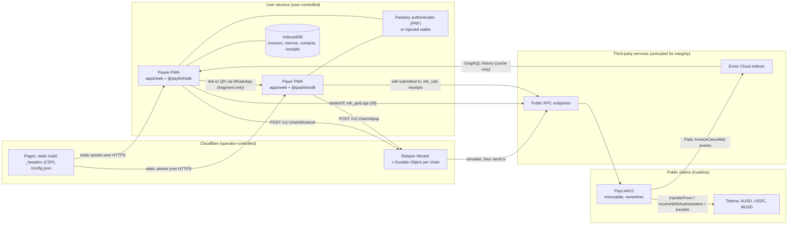

# PayLink v2 architecture

| | |
|---|---|
| **Status** | Accepted baseline for v2.0 (contract freeze: tag `contracts-v2.0.0`, 2026-10-07) |
| **Date** | 2026-10-05; revised 2026-10-07 (deployment checks aligned with `protocol/script/`, till and receipt display rules, invariant catalogue, Mermaid fix) |
| **Owner** | nambininasafidison. Engineering by Claude Code; see [AI_DISCLOSURE.md](../AI_DISCLOSURE.md). |
| **Normative companions** | [Invoice format specification](spec/paylink-invoice-v2.md) · [Architecture decision records](adr/README.md) · [Threat model](security/THREAT_MODEL.md) · [Invariants](security/invariants.md) |
| **Documentation map** | [docs/README.md](README.md) |

This document describes how PayLink v2 is built: its components, how data moves between them, where the trust boundaries lie, and which source of data wins when sources disagree. Every external fact carries the confidence tag used in the engineering plan:

| Tag | Meaning |
|---|---|
| **UV** | The owner verified it on the official page on 2026-10-05, or on the later date given with the tag. |
| **C** | Confirmed: a primary source or code was read, or it was checked live from the sandbox. |
| **L** | Likely: consistent secondary sources. |
| **U** | Unverified: a single source. |

## Contents

1. [Purpose and scope](#1-purpose-and-scope)
2. [System overview](#2-system-overview)
3. [Components](#3-components)
4. [Data flows](#4-data-flows)
5. [Trust boundaries](#5-trust-boundaries)
6. [Deployments and code integrity](#6-deployments-and-code-integrity)
7. [Data and privacy](#7-data-and-privacy)
8. [Editions](#8-editions)
9. [Client security architecture](#9-client-security-architecture)
10. [Chain-specific engineering](#10-chain-specific-engineering)
11. [Failure modes and degradation](#11-failure-modes-and-degradation)
12. [Quality gates](#12-quality-gates)
13. [Decision index](#13-decision-index)

---

## 1. Purpose and scope

PayLink v2 issues **signed, non-custodial dollar invoices and payment links**. The product story is the same in every edition:

> A Malagasy freelancer sends a dollar invoice on WhatsApp. The client abroad opens it and pays with a fingerprint, holding no gas token. The freelancer's till lights up in under a second. Both sides keep a receipt anyone can verify.

**In scope:** the `PayLinkV2` contract, the TypeScript packages, the progressive web app (PWA), the relayer, the indexer, CI/CD and hosting.

**Out of scope:** PayLink v1, the Arc Microgrants entry. Its files (`contracts/PayLink.sol`, `web/`, `scripts/compile.js`, `scripts/deploy.js`, `test/`, `verify/`, `package.json`, `package-lock.json`) are frozen byte for byte ([ADR 0010](adr/0010-arc-stays-on-v1.md)). v2 lives in new top-level folders ([ADR 0011](adr/0011-workspace-layout.md)).

## 2. System overview

```text
   payee device (PWA on <app>.pages.dev)              payer device (same PWA, any country)
   ┌───────────────────────────────┐   WhatsApp /   ┌────────────────────────────────────┐
   │ Create: sign EIP-712 Invoice  │── link / QR ──▶│ Pay: verify sig + chain + contract │
   │ (Mera passkey or wallet),     │   (#fragment)  │ sign EIP-3009 auth (passkey)       │
   │ store in IndexedDB            │                └──────────────┬─────────────────────┘
   │ Till: poll Paid(payee) ◀──────┼──────────┐                    │ POST /v1/:chain/pay
   └───────────────┬───────────────┘          │                    ▼
                   │ statesOf / receipts      │      ┌────────────────────────────────┐
                   ▼                          │      │ Relayer (CF Worker + 1 Durable │
   ┌───────────────────────────────┐          │      │ Object per chain): validate →  │
   │ PayLinkV2 (immutable, no owner)│◀─────────┼──────│ eth_call simulate → send with  │
   │ Monad 10143 · Base 84532 ·     │  tx      │      │ clamped gas limit              │
   │ Arb 421614 · Mezo 31611 (later)│──────────┘      └────────────────────────────────┘
   └───────────────┬───────────────┘ events (Paid, InvoiceCancelled)
                   ▼
   ┌───────────────────────────────┐   GraphQL (cache only; receipts verified on RPC)
   │ Envio HyperIndex (Envio Cloud) │──────────────▶ ledger history, stats, trust line
   └───────────────────────────────┘
   Arc mainnet 5042: frozen v1 (registry model) served from GitHub Pages /paylink/web/
```

The same view as a component graph, with the trust zones that [§5](#5-trust-boundaries) details:



## 3. Components

| Component | Location | Technology (exact pins) | Responsibility | Trusted for |
|---|---|---|---|---|
| **PayLinkV2 contract** | `protocol/src/PayLinkV2.sol` | Solidity 0.8.30, EVM `paris`, OpenZeppelin Contracts 5.3.0, Foundry 1.8.5 | Verifies payee signatures, enforces invoice rules, settles payments without custody, records one slot per key | Correctness and settlement. Immutable, no owner ([ADR 0004](adr/0004-immutable-ownerless-feeless.md)) |
| **Chain registry** | `packages/chains` (`@paylink/chains`) | TypeScript; EIP-55-tested addresses | Chains, RPC fallbacks, explorers, token allowlist and decimals, capability flags, gas floor and ceiling per function and chain, generated deployment records | The client's root of trust for addresses ([spec §4.2](spec/paylink-invoice-v2.md#42-resolving-verifyingcontract)) |
| **SDK** | `packages/sdk` (`@paylink/sdk`) | viem 2.57.3 | Invoice build, sign and verify; strict URL codec; PaymentRouter; receipt verifier; custom-error decoder mapped to i18n keys; 6- and 18-decimal amount math | Reproducing the contract's rules off-chain; golden vectors |
| **Design system** | `packages/design` | CSS layers; Archivo and Martian Mono (OFL) | v1 "Precision Terminal" tokens copied verbatim; components | Presentation only |
| **Translations** | `packages/i18n` | EN, FR, MG JSON with typed keys | Whole-sentence messages; completeness test | Presentation only. Malagasy strings are written or reviewed by the founder |
| **Web app** | `apps/web` | Vite 8.3.2 multi-page app, TypeScript 6.0.3, vite-plugin-pwa 2.0.0, no framework ([ADR 0006](adr/0006-vanilla-typescript-port-at-parity.md)) | Routes `/`, `/pay/`, `/r/`, `/ledger/`, `/send/`, `/till/`, `/deploy/`, `/status/`; editions ([§8](#8-editions)) | Displaying exactly what is signed; holding passkey-derived keys in memory |
| **Account providers** | inside `apps/web` | EIP-6963 discovery; `@category-labs/mera` 0.2.0 (preview, lazy); `@base-org/account` 2.5.13 (lazy) | One `AccountProvider` interface `{address, chainId, kind, signTypedData, sendCalls?}` | Producing signatures the user approved |
| **Relayer** | `apps/relayer` | Cloudflare Worker, Hono 4.13.13, zod 4.6.5, viem; one Durable Object `ChainSender` per chain; Node adapter for e2e; deployed by Cloudflare's Git integration from the committed bundle `apps/relayer/deploy/` ([runbook](runbooks/relayer.md)) | Submits `payWithAuthorization` and `cancelBySig` only; testnet onboarding; nonce, queue, caps and gas budget | **Availability only.** It can delay a payment but cannot redirect it ([ADR 0003](adr/0003-bind-3009-nonce-to-payment.md), [ADR 0007](adr/0007-relayer-durable-object-per-chain.md)) |
| **Indexer** | `apps/indexer` | Envio HyperIndex 3.12.1 on the Envio Cloud free development plan | Entities `Payment`, `LinkAgg`, `PayeeStats`, `PayerPayee`, `DailyVolume` for history, statistics and the trust line | **Nothing authoritative.** Cache only ([ADR 0009](adr/0009-read-model-chain-device-indexer.md)) |
| **API** (from Oct 28) | `apps/api` | Hono on Workers | PayPal bridge and AI back-office copilot (PayPal edition) | Out of scope for v2.0 |
| **End-to-end tests** | `e2e/` | Playwright 1.56.1 on Chromium 141; anvil chains; EIP-1193 test wallet; CDP WebAuthn virtual authenticator with PRF | Release gate for user flows and accessibility | Evidence |
| **CI/CD** | `.github/workflows/` | GitHub Actions pinned by commit SHA | Gates, nightly proofs, deployments, Pages and Worker deploys | Release integrity |

### 3.1 Contract surface

Six state-changing entry points and four views. The full interface is in PAYLINK-V2-SPEC §3.3.2 and in `protocol/src/interfaces/IPayLinkV2.sol`; its semantics are in the [specification §7–§9](spec/paylink-invoice-v2.md#7-payment-semantics), and the properties it guarantees are catalogued in [invariants.md](security/invariants.md).

| Kind | Functions |
|---|---|
| Settlement (`nonReentrant`, checks-effects-interactions, payee signature checked on every payment) | `payWithAuthorization`, `pay`, `payWithPermit`, `payNative` |
| Revocation | `cancel`, `cancelBySig` |
| Views | `invoiceKey`, `paymentNonce`, `stateOf`, `statesOf` (≤ 256 keys), plus ERC-5267 `eip712Domain()` and the three type-hash constants |

Only audited OpenZeppelin modules are used: `EIP712`, `SignatureChecker`, `ECDSA`, `SafeERC20`, `ReentrancyGuard` and `Address`. The single known advisory against 5.3.0, GHSA-9rcw-c2f9-2j55 (`Bytes.lastIndexOf`), affects `utils/Bytes.sol`, which is outside this import graph: the contract's full import closure is 26 files, none of them `Bytes.sol` (**C**: `npm audit` on 2026-10-05; solc source list on 2026-10-07). `protocol/test/toolchain/ReleaseGraph.t.sol::test_BytesSolIsNotCompiledIn` asserts on every `forge test` that the file is absent from the release artifact's own source list (the `.metadata.sources` of `out/PayLinkV2.sol/PayLinkV2.json`); `contracts.yml` will run it in CI once the workflows land, planned for T0 ([ADR 0002](adr/0002-one-paris-bytecode-oz-5-3-0.md)).

### 3.2 Payment routing

The SDK's PaymentRouter chooses one path from the token's capabilities, the payer's account kind, the relayer's health and the payer's outstanding authorisation for the link ([spec §8.6](spec/paylink-invoice-v2.md#86-retries-and-outstanding-authorisations)):

| Situation | Path | What the payer needs |
|---|---|---|
| EIP-3009 token (USDC, AUSD), code-less EOA or Mera payer, relayer healthy | `payWithAuthorization` through the relayer | 1 signature, 0 gas |
| Same, relayer down | the payer submits the authorisation itself, or uses `payWithPermit` | gas |
| An authorisation for this link is still live (the relayer is slow) | resubmit **that** authorisation, to the relayer or by the payer; permit and approve-and-pay only after `cancelAuthorization` is mined or the authorisation expires | 0 gas, or gas |
| The authorisation was consumed | none: show "paid", verify the receipt | nothing |
| EIP-2612 token (MUSD, AUSD, USDC) | `payWithPermit` | 1 signature and 1 transaction |
| Smart-account payer (Base Account), or an EOA with an EIP-7702 delegation (the token would check its EIP-3009 signature through ERC-1271) | EIP-5792 `wallet_sendCalls([approve, pay])` | 1 approval |
| Anything else | `approve` then `pay`, with an exact-amount allowance | 2 transactions |
| Native coin (Arc, tier T2) | `payNative` | the coin |

## 4. Data flows

### 4.1 Create and share an invoice (offline-capable, zero gas)

1. The payee fills in the amount, the token, the expiry (7 days by default), the number of payments and an optional memo on `/`.
2. The client draws a 32-byte salt from `crypto.getRandomValues`, computes `memoHash`, and resolves `verifyingContract` from the registry.
3. The SigningDisplay shows exactly what is being signed. The payee approves with a passkey (Mera) or a wallet (`eth_signTypedData_v4`).
4. The client verifies the signature locally, stores the signed invoice and memo in IndexedDB, and encodes the fragment `#2.<chainId>.<inv>.<sig>[.<memo>]`.
5. The share sheet offers copy, QR code (drawn with `createElementNS`), Web Share and `wa.me`. No server is involved, and creation works offline.

### 4.2 Gasless payment through the relayer

```mermaid
sequenceDiagram
  autonumber
  participant P as Payer PWA
  participant R as Relayer (Worker + DO)
  participant C as PayLinkV2
  participant T as Token (EIP-3009)
  P->>P: strict decode, registry lookup, four checks (signature, network, contract, still payable)
  P->>P: no outstanding authorisation for (link, payer) in IndexedDB, or it is dead (spec §8.6)
  P->>P: payerSalt := random, then nonce := paymentNonce(key, payer, amount, payerRef, payerSalt)
  P->>P: sign token ReceiveWithAuthorization(to = PayLinkV2, nonce) after the SigningDisplay
  P->>P: store the signed relay body before sending it
  P->>R: POST /v1/:chainId/pay {invoice, payeeSig, authorization}
  R->>R: zod schema, registry, selector and value checks, payee and payer signatures with the contract's and the token's dispatch, nonce, caps
  R->>R: time bounds valid for at least the chain's relay margin (120 s) after the simulated block
  R->>R: admission: in-flight bounds per key, payee, payer and token; requester rate per IPv4 or IPv6 /64; bans; code policy
  R->>C: eth_call simulation, then again (with the margin) against the pending block before broadcast
  R->>C: send payWithAuthorization with a clamped gas limit
  C->>C: checks, then effects: payments++, total += amount, emit Paid
  C->>T: receiveWithAuthorization(payer → PayLinkV2, recomputed nonce)
  C->>T: transfer(PayLinkV2 → payee), then delta checks
  R-->>P: txHash
  R->>R: on a revert after a passing simulation, attribute it from chain evidence and ban only that party
  P->>P: verify receipt on RPC, show "settled in N.N s", store receipt
```

If the relayer is unavailable, refuses the request or is slow, the PWA offers "Pay with your own gas" with the same signed authorisation ([spec §8.5](spec/paylink-invoice-v2.md#85-resulting-guarantees)). It never signs a second authorisation, or switches to permit or approve-and-pay, while the first can still land: on a receive card, a till or an N-seat link both would settle ([spec §8.6](spec/paylink-invoice-v2.md#86-retries-and-outstanding-authorisations)).

### 4.3 Self-submitted payment

The payer's wallet sends `payWithPermit`, `pay` after an exact-amount `approve`, `wallet_sendCalls([approve, pay])` for a smart account, or `payNative`. The gas limit is `clamp(eth_estimateGas × 1.10, floor, ceiling)`, with the floor and ceiling taken from `@paylink/chains` ([§10](#10-chain-specific-engineering)).

### 4.4 Cancellation

- **With gas:** the payee calls `cancel(inv)`.
- **Gasless:** the payee signs `Cancel(key, deadline)`, and the relayer submits `cancelBySig` after the same validation pipeline as for payments.

Either way the `InvoiceCancelled` event updates the indexer, and `statesOf` reports `cancelled = true`.

### 4.5 Receipt verification

`/r/#2.<chainId>.<txHash>.<logIndex>[…]` runs the algorithm of [spec §12](spec/paylink-invoice-v2.md#12-receipt-verification) against a registry RPC. It never uses the indexer, and it always displays what the receipt proves (payee, token, amount and, when attached, the invoice), never a bare "valid" ([THREAT_MODEL T-43](security/THREAT_MODEL.md#t-43)). The receipt prints at 80 mm and A6 with print CSS; there is no client-side PDF library.

### 4.6 Till mode

`/till/` polls `eth_getLogs` every second with `fromBlock = head − 10`, filtered on the `Paid` topic for the payee. That keeps every query far inside the 100-block cap of Monad's public RPC endpoints (**L**). On a new event it verifies the receipt first, then lights the green LED, plays the chime and shows the amount in large digits. When an invoice is armed on the till, only a `Paid` for that invoice's key and amount lights it, so a small payment to the merchant's receive card cannot pass for the invoice ([THREAT_MODEL T-44](security/THREAT_MODEL.md#t-44), [spec §13.4](spec/paylink-invoice-v2.md#134-payment-arrival-displays)).

Timing figures are always measured, never quoted; Monad's 300 ms blocks and 600 ms finality are **L**. The "settled in N.N s" readout is measured on the payer's device, from submitting the signed payment to verifying its receipt. The till cannot observe the submission, so its own readout is the time from arming the invoice (showing its QR code) to the verified `Paid` event, and its label says so.

### 4.7 Ledger

`/ledger/` merges three sources with a fixed precedence ([§7.1](#71-read-model-chain--device--indexer)):

- `statesOf` for every key the device knows;
- the device's signed invoices, memos and receipts;
- indexer history for keys the device does not know, for example after a device change.

The CSV export follows RFC 4180, ISO 8601 and CAIP-10.

### 4.8 Testnet onboarding (Monad edition)

`POST /v1/10143/onboard` makes the relayer call the AUSD faucet `requestFunds(user)` at `0xd236c18D274E54FAccC3dd9DDA4b27965a73ee6C` (**C**, checked on a fork on 2026-10-07: 10,000 AUSD per drip, one global 60 s cooldown; it ran dry once, **L**). It is capped per day, per address and per requester, and exists only on Monad testnet. If the faucet refuses, the client is told to retry after a minute: the relayer holds no AUSD and never signs a token transfer (revised 2026-10-08; [THREAT_MODEL T-33](security/THREAT_MODEL.md#t-33)).

### 4.9 Contract deployment

Two routes, both described in the [deploy runbook](runbooks/deploy.md):

- **Route A:** the `deploy-testnet.yml` workflow, gated by an environment with a required reviewer.
- **Route B:** the browser page `/deploy/`.

Both show the predicted address and the `initCodeHash` before anything is signed. The resulting `deployments/<chainId>.json` is checked by `deployments-check.yml` ([§6](#6-deployments-and-code-integrity)).

## 5. Trust boundaries

| ID | Boundary | What crosses it | Assumption | Controls |
|---|---|---|---|---|
| TB1 | Payee device → messaging channel → payer device | the invoice URL (fragment) | The channel is untrusted: it can read, alter or replace the link | Signature over every field; registry-pinned contract; strict decoding; first-payment warning ([THREAT_MODEL T-04](security/THREAT_MODEL.md#t-04)) |
| TB2 | Web origin → authenticator or wallet | typed data to sign; passkey PRF output | The origin is trusted to show exactly what is signed; Mera keys live in page memory | Dedicated origin; strict CSP; no third-party scripts; SigningDisplay ([ADR 0005](adr/0005-dedicated-origin-and-rpid.md)) |
| TB3 | Client → public RPC | reads, simulations, signed transactions | RPCs can lie or fail | viem `fallback()` across registry RPCs; chain is truth only through RPC answers; cross-check on two RPCs planned (T2) |
| TB4 | Client → relayer | signed invoice and authorisation | The relayer can drop or delay requests | Bound nonce (I8); short `validBefore`; self-submission fallback |
| TB5 | Relayer → chain | transactions from a testnet hot key | The key can leak; the budget can be drained, also by calls that pass simulation and revert on inclusion (a payee's ERC-1271 answer, a `cancel`, a payer's EIP-7702 delegation, a time bound that ends one second after the simulated block) | Testnet-only key holding at most about 2 MON; caps; a per-chain margin on every time bound; simulation first and again against the pending block; in-flight bounds per key, payee, payer and token; day-long bans of the party a post-simulation revert is attributed to, never of a payee for a payer's failure ([spec §13.3](spec/paylink-invoice-v2.md#133-relayers)); only two selectors; never sends value |
| TB6 | Chain → indexer → client | events and aggregates | The indexer can be stale, down or wrong | Never authoritative; receipts verified on RPC; "history unavailable" fallback |
| TB7 | GitHub → Cloudflare and chains | builds, Worker deploys, contract deployments | CI can be attacked through pull requests, actions or secrets | SHA-pinned actions; least-privilege `permissions`; no `pull_request_target`; environments with a required reviewer |
| TB8 | Developers and AI agents → repository | code, dependencies, documentation | Contributions can be wrong or malicious; agents can be prompt-injected | Required checks; owner review; agents never push `main` or hold keys ([AI_DISCLOSURE.md](../AI_DISCLOSURE.md)) |
| TB9 | Package registries → build | npm and PyPI packages, release binaries | Maintainer accounts can be compromised | Exact pins; lockfile integrity; `strictDepBuilds`; `trustPolicy: no-downgrade`; hash-locked Python; digest-pinned binaries ([ADR 0012](adr/0012-toolchain-pinning-and-vendoring.md)) |

## 6. Deployments and code integrity

- **One artefact.** `PayLinkV2` is compiled once with solc 0.8.30, `evm_version = paris`, optimizer at 10,000 runs, no via-IR and default CBOR metadata. The constructor takes no arguments, so the `initCodeHash` is identical on every chain ([ADR 0002](adr/0002-one-paris-bytecode-oz-5-3-0.md)).
- **Runtime code differs per chain.** OpenZeppelin `EIP712` stores seven immutables in it: the cached chain ID, the cached domain separator, `address(this)`, the hashed name and version, and the two ShortStrings. A deployment is therefore accepted only after four checks, implemented once in `protocol/script/utils/PayLinkRelease.sol` and applied by the deploy scripts, `deployments-check.yml` and `/status/`:
  1. the `initCodeHash` equals the release artefact (`protocol/deployments/release.json`);
  2. the runtime code, with every `immutableReferences` range zeroed and the CBOR metadata stripped, has the release's masked runtime hash;
  3. the seven immutable words equal the values recomputed from `(chainId, address)`, which rejects genuine code copied from another deployment;
  4. the ERC-5267 `eip712Domain()` returns `fields = 0x0f`, `PayLink`, `2`, this chain and this address.
- **Addresses.** CREATE2 goes through the deterministic deployer `0x4e59b44847b379578588920cA78FbF26c0B4956C` where `eth_getCode` shows it exists, with salt `keccak256("paylink.v2.0.0")`. Otherwise the deploy uses CREATE. The deployer exists on Arc mainnet (**C**); check the other chains at deploy time. The same address on every chain is a nice-to-have (tier T2).
- **Records.** `protocol/deployments/<chainId>.json` (schema `paylink.deployment/1`, specified in `protocol/deployments/README.md`) holds the address in EIP-55 and CAIP-10 form, the CAIP-2 chain identifier, the method, the transaction hash, the block, the deployer, the CREATE2 salt, the `initCodeHash`, the masked and actual runtime hashes, the solc version and settings hash, the OpenZeppelin version, the git commit, the verified EIP-712 domain and explorer links. `@paylink/chains` is generated from these records, and adds a `status` per deployment (`active`, `deprecated` or `revoked`) that clients enforce ([spec §4.2](spec/paylink-invoice-v2.md#42-resolving-verifyingcontract)).
- **Registry.** Only addresses from PAYLINK-V2-SPEC §3.4, with their confidence tags, enter `@paylink/chains`, and each passes an EIP-55 test:

| Chain | Role | Default token (decimals) | Confidence |
|---|---|---|---|
| Monad testnet 10143 | Monad Metropolis edition | AUSD `0xa9012a055bd4e0eDfF8Ce09f960291C09D5322dC` (6, EIP-2612 + EIP-3009); Circle USDC `0x534b2f3A21130d7a60830c2Df862319e593943A3` (6), hidden in the demo | chainId C; RPC L; AUSD C; USDC C |
| Base Sepolia 84532 | Colosseum edition | USDC `0x036CbD53842c5426634e7929541eC2318f3dCF7e` (6, EIP-2612 + EIP-3009). Not the `…dCF7c` typo from the Base docs | C |
| Arbitrum Sepolia 421614 | optional | USDC `0x75faf114eafb1BDbe2F0316DF893fd58CE46AA4d` (6) | C |
| Mezo testnet 31611 | from Oct 16 | MUSD `0x118917a40FAF1CD7a13dB0Ef56C86De7973Ac503` (18, EIP-2612 only) | C; EVM level "london" L |
| Monad mainnet 143 | ready, disabled (T2) | AUSD `0x00000000eFE302BEAA2b3e6e1b18d08D69a9012a`; USDC `0x754704Bc059F8C67012fEd69BC8A327a5aafb603` | C |
| Arc mainnet 5042 | v1 only | native USDC (18 decimals) | C |

`0xf817257fed379853cDe0fa4F97AB987181B1E5Ea` on Monad testnet is **not** Circle's USDC and must never be used (PAYLINK-V2-SPEC §3.4).

## 7. Data and privacy

### 7.1 Read model: chain > device > indexer

When sources disagree, the higher one wins ([ADR 0009](adr/0009-read-model-chain-device-indexer.md)).

| Rank | Source | Authoritative for | Never used for |
|---|---|---|---|
| 1 | **Chain** (through registry RPCs) | invoice state (`stateOf`, `statesOf`), receipts (`eth_getTransactionReceipt`), deployment code | — |
| 2 | **Device** (IndexedDB, every access wrapped in `try/catch`) | signed invoices and memos (the chain only ever sees `memoHash`), receive cards, the address book, settings, cached receipts | payment status without a chain check |
| 3 | **Indexer** (Envio GraphQL) | nothing. It provides history, statistics and the trust line as a cache | receipts, the payability checks, any value that gates a payment |

Rules that follow:

- A ledger row shows "Paid" only from `statesOf` or from a receipt verified on RPC.
- When the indexer is down or its URL has expired, the UI shows "history unavailable" and keeps working from the chain and the device. An Envio development deployment lives at most 30 days, and its URL changes on every push (**L**).
- The indexer URL comes only from same-origin `/config.json`, never from a link.

### 7.2 What is stored where

| Data | Location | Notes |
|---|---|---|
| Signed invoices, memos, receive cards, address book, receipts, settings | the device's IndexedDB | JSON export and import, with a plaintext warning (T1). A passkey-encrypted backup is planned for T2: a second PRF evaluation with salt `"paylink.books.v1"`, then HKDF-SHA-256 to an AES-256-GCM key; it never reuses the signing-key PRF output |
| Invoice terms (minus the memo text) and `payerRef` | public chain, once paid or cancelled | `memoHash` is unsalted; see [spec §15](spec/paylink-invoice-v2.md#15-privacy-considerations) |
| Aggregates | Envio Cloud | derived from public events only |
| FX rates (display only) | `fx.json`, refreshed by a daily Actions job | always labelled "estimate · source · date"; never used in amount calculations |
| Server-side personal data | none | no server database and no analytics |

## 8. Editions

One codebase is built as several editions, selected at build time with `VITE_EDITION` and tree-shaken ([ADR 0008](adr/0008-editions.md)). Only three things vary: the account layer, the default token and the payment rail.

| Edition | Chains | Default token | Accounts | Flags |
|---|---|---|---|---|
| `monad` | 10143 (143 ready) | AUSD | Mera passkeys only | gasless, onboarding, till, send, indexer |
| `base` | 84532 (+ 421614) | USDC | EIP-6963 wallets; Base Account for payers | gasless for EOAs, EIP-5792 batching |
| `all` | every registry chain | per chain | EIP-6963 wallets | — |
| `mezo` (later) | 31611 | MUSD | EIP-6963 wallets | permit path |
| `paypal` (later) | per edition | — | — | PayPal sandbox rail |

`?chain=` switches only among an edition's own chains.

## 9. Client security architecture

The `public/_headers` file of the Cloudflare Pages project sets:

- `Content-Security-Policy: default-src 'none'; script-src 'self'; style-src 'self'; img-src 'self' data: blob:; font-src 'self'; connect-src 'self' <registry RPCs, relayer, indexer>; worker-src 'self'; manifest-src 'self'; base-uri 'none'; form-action 'none'; frame-ancestors 'none'`.
- At tier T1, `require-trusted-types-for 'script'; trusted-types paylink-sw`, gated by a production-headers e2e test. If that test fails at the T1 freeze, the release ships without Trusted Types, and the ESLint DOM-sink bans still apply.
- `Referrer-Policy: no-referrer`, `X-Content-Type-Options: nosniff`, and a `Permissions-Policy` that turns everything off except `publickey-credentials-get=(self)`.

The design behind these headers:

- **Dedicated origin, fixed rpId.** The rpId is `<app>.pages.dev`, fixed before the first passkey is created. `pages.dev` is on the Public Suffix List, so the project host is its own site. Preview deployments are disabled, because `*.<app>.pages.dev` previews could claim the same rpId ([ADR 0005](adr/0005-dedicated-origin-and-rpid.md)).
- **No DOM injection sinks.** The typed `h()` DOM builder only ever sets `textContent`. ESLint bans `innerHTML`, `outerHTML`, `insertAdjacentHTML`, `document.write`, `eval` and `new Function`.
- **No third-party code at runtime.** No CDNs, no analytics, no Turnstile.
- **Frame lock in JavaScript** in addition to `frame-ancestors`: the Pay key stays disabled when `top !== self`.
- **Untrusted text.** Memos are stripped of bidirectional and control characters and labelled as a note from the sender. Clipboard copies come from canonical state.

## 10. Chain-specific engineering

- **Monad charges the gas limit, not the gas used (C).** The relayer and the UI therefore send `gasLimit = clamp(eth_estimateGas × 1.10, floor, ceiling)`. Floor and ceiling are per function and per chain in `@paylink/chains` (the floor is the measurement, the ceiling is 1.5 × the measurement, to cover ERC-1271 payees), and validated with cold slots on Monad testnet. For Ethereum-priced chains the measurement is the `forge snapshot`; for Monad it is `eth_estimateGas` on anvil 1.8.5's Monad emulation (`--network monad`, hardfork MonadTen, selected automatically for chain ID 10143), which applies Monad's opcode prices (a first gasless payment needs about 223,000 gas there, against 167,000 at Ethereum prices). Whether anvil also charges the full limit was not checked. See [`packages/chains/README.md`](../packages/chains/README.md#gas-bounds-spec-336).
- **Monad reserve balance (C).** An EOA with 0 MON cannot send anything; the reserve is 10 MON. The relayer never sends value and is never EIP-7702-delegated. Mera merchants and payers never hold MON, because the relayer pays the gas.
- **Monad cold access (L).** SLOAD and SSTORE cost 8,100 gas when cold, and account access 10,100. Hence one slot per key, written lazily, and `statesOf` as one batched view.
- **Mezo (L: London-level EVM).** The `paris` artefact contains no PUSH0, MCOPY or transient-storage opcodes. `protocol/test/toolchain/EvmTarget.t.sol` enforces that on the compiled bytecode.
- **Arc (C).** The native USDC uses 18 decimals, and its ERC-20 interface at `0x3600000000000000000000000000000000000000` uses 6. v2 on Arc is tier T2. v1 uses native value only.

## 11. Failure modes and degradation

| Failure | Detection | Degraded behaviour | Owner action |
|---|---|---|---|
| Relayer down, unfunded or over budget | `GET /v1/health`; the status LED; request errors | "Pay with your own gas"; cancel with gas | refill from a faucet; see the [incident response](security/incident-response.md) |
| Indexer down or URL expired | health check in `/config.json` | "history unavailable"; ledger from chain and device | redeploy on Envio Cloud; update `/config.json` |
| An RPC is down or inconsistent | viem `fallback()` | next registry RPC | rotate endpoints in the registry |
| Mera or PRF unavailable on a device | onboarding error | Monad edition fallback to an injected wallet (the Oct 9 go/no-go) | none at runtime |
| Contract vulnerability | private report, CI, monitoring | warning banner from `/config.json`; deployment flagged in the registry; the Pay key locks | redeploy a fixed version ([ADR 0004](adr/0004-immutable-ownerless-feeless.md), [incident response](security/incident-response.md)) |
| Cloudflare sign-up or service unavailable | — | fallback host: a dedicated GitHub organisation `<org>.github.io` with a meta CSP and the JavaScript frame lock; relayer on another free host (Deno Deploy or Vercel Hobby, both **U**) | [ADR 0005](adr/0005-dedicated-origin-and-rpid.md) |

## 12. Quality gates

The blocking gates, the nightly evidence jobs and the commit conventions are summarised in [CONTRIBUTING.md](../CONTRIBUTING.md). The security review procedure is in [docs/security/self-review.md](security/self-review.md). Headline numbers:

- **Contract:** coverage ≥ 95 % of lines and ≥ 90 % of branches on `src/`; invariants I1–I11 ([catalogue](security/invariants.md)) at 256 runs × depth 128 in CI; fuzzing at 10,000 runs in CI; Slither with no untriaged medium-or-higher finding.
- **Packages:** SDK coverage ≥ 90 %, chains 100 %, relayer ≥ 85 %.
- **Web:** axe reports zero violations on every route, in light and dark themes; the pay route loads at most 110 kB of gzipped JavaScript.

## 13. Decision index

| ADR | Decision |
|---|---|
| [0001](adr/0001-signed-invoices-no-onchain-create.md) | Signed invoices, no on-chain create |
| [0002](adr/0002-one-paris-bytecode-oz-5-3-0.md) | One paris bytecode with OpenZeppelin 5.3.0 |
| [0003](adr/0003-bind-3009-nonce-to-payment.md) | Bind the EIP-3009 nonce to the payment |
| [0004](adr/0004-immutable-ownerless-feeless.md) | Immutable, ownerless, fee-less |
| [0005](adr/0005-dedicated-origin-and-rpid.md) | Dedicated origin and rpId |
| [0006](adr/0006-vanilla-typescript-port-at-parity.md) | Port to vanilla TypeScript at parity (no framework) |
| [0007](adr/0007-relayer-durable-object-per-chain.md) | Relayer with one Durable Object per chain |
| [0008](adr/0008-editions.md) | Editions |
| [0009](adr/0009-read-model-chain-device-indexer.md) | Read model: chain > device > indexer |
| [0010](adr/0010-arc-stays-on-v1.md) | Arc stays on v1 |
| [0011](adr/0011-workspace-layout.md) | pnpm workspace at the root, with the frozen v1 manifest as the root project |
| [0012](adr/0012-toolchain-pinning-and-vendoring.md) | Toolchain pinning, sandbox bootstrap and vendored forge-std |
| [0013](adr/0013-browser-deploy-page.md) | Browser deploy page on the current Pages root, sharing one verifier with a CLI |
